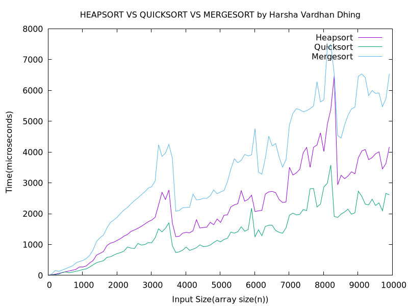

    # DAA Case Study

    Graph of time of execution of Heapsort, Quicksort and Mergesort

    ## Contents

    There are 3 C++ programs: heapsort.cpp, quicksort.cpp and mergesort.cpp.
    There is a bash script run.sh.

    ## Prerequisites
    
    * g++ (GCC) version 14.2.1
    * gnuplot version 6.0 
    * GNU bash version 5.2.32
    * feh version 3.10.3
   
    ## Usage

    Execute the script run.sh.
    The graph is created as a png file named sorting_plot.png.

    

